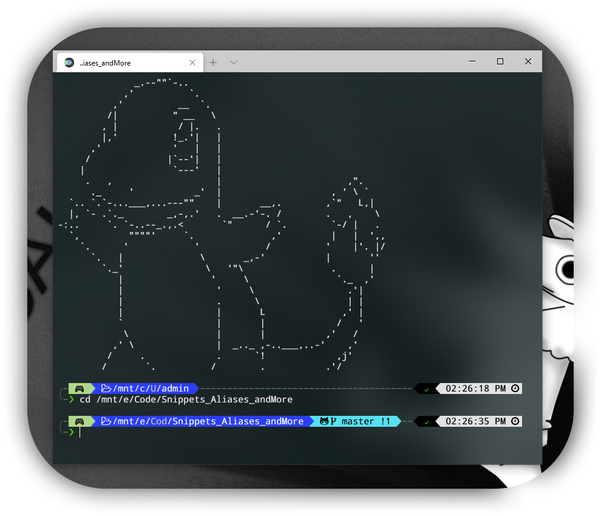
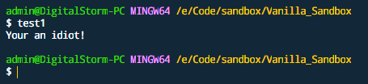
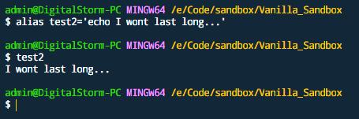
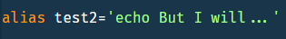
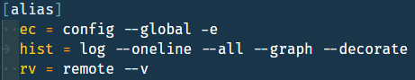
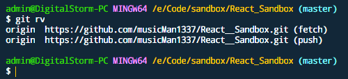
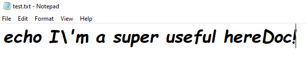
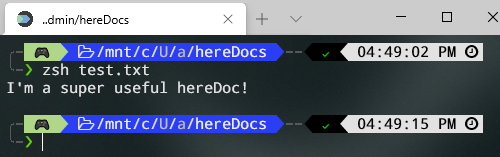
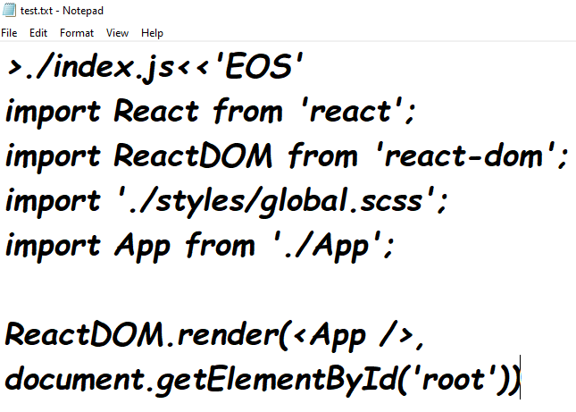
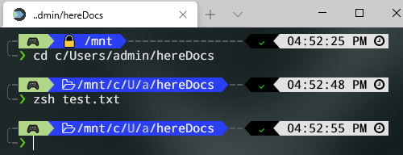

<!--
*** I'm using markdown "reference style" links for readability.
*** https://www.markdownguide.org/basic-syntax/#reference-style-links
-->
[![Contributors][contributors-shield]][contributors-url]
[![Forks][forks-shield]][forks-url]
[![Stargazers][stars-shield]][stars-url]
[![Issues][issues-shield]][issues-url]
[![MIT License][license-shield]][license-url]
[![LinkedIn][linkedin-shield]][linkedin-url]

<!-- PROJECT LOGO -->
 

  

  <h3 align="center">My Personal "dot" Files</h3>

  

    My personal dumping ground for my secrets to optimal laziness!
     
    <a href="https://github.com/musicMan1337/dot_files"><strong>Explore the docs »</strong></a>
     
     
    <a href="https://github.com/musicMan1337/dot_files/issues">Report Bug</a>
    ·
    <a href="https://github.com/musicMan1337/dot_files/issues">Request Feature?</a>
  

---
<!-- About The Project -->
# gitBash || WSL-Ubuntu || hereDocs
### First you get the money, then you get the [*powerlevel10k...*][p10k]...

###### *I won't get into the specifics on setting up WSL here, but know that I personal run Ubuntu on my local Network, using oh-my-zsh terminal and the powerlevel10k theme.  That said, shell-specific scripts will need minor tweaking depending on your own personal dev environment!*
>

## Shell Aliases:

>##### An alias is basically a variable that you can assign a shell script to, then run it in the terminal. For example:
>
>
>
>###### *...ran in terminal...*
>
>
>
>##### You can create aliases mainly two ways:
>1. In the terminal, for a temporary alias:
>
>
>
>2. In your .bashrc file, for a permanent alias:
>
>
>
>>> ###### *Note your .bashrc should be located in your root directory (cd ~). If by chance it doesn't exist, just create one!*
>

## Git Aliases:

>>>###### *Git aliases function the same way as shell aliases, but have somewhat different syntax. You could technically create shell aliases to do the same thing, though I personally like separating git and shell aliases.*
>##### You can create git aliases in your .gitconfig file located in your rootdirectory. It should have been created and filled with some stuff after using git for the first time, but if it's not there you can always create your own .gitconfig from scratch.
>* ##### In your .gitconfig file, create aliases in the designated area:
>
>
>
>* ##### You can then invoke the git-specific alias in the terminal:
>
>
>
>>> ###### *Note your .bashrc should be located in your root directory (cd ~). If by chance it doesn't exist, just create one!*
>>> ###### *Also, these are just very basic use cases, and there ar many advanced ways to create scripts such as using functions, combining scripts, using variables, and much more...*
>

## Here Docs:
*(are OP...)*

>>>###### *Here Docs are fairly complex, but on the surface level they are basically just fields of text that can either run complex scripts or create new files populated with said text.*
>##### 1. I'd suggest creating a folder specifically for your hereDocs in your root directory, and treat the folder itself as a type of .bashrc file, where your "aliases" are actually hereDoc files.
>##### 2. The easiest way to create a hereDoc is to create a new .txt file (testDoc.txt)
>>>###### *Note that hereDocs don't need to strictly be .txt, nor are there naming conventions for the file name. Basically, you just need to be able to edit the text within the file*
>##### 3. Let's create 2 simple hereDocs - create test.txt then open:
>* ###### For running a script, the file itself acts like an alias:
>
>
>
> *...in terminal, invoke with shell name (here I'm using zsh)...*
>
>
>
>* ###### For generating a new file, you'll need to use "delimiters" (here it's "EOS", but it could be anything as long as the match) to wrap the body of your doc, prefaced by a command. In this case, since we aren't running scripts at the end, we only need an opening delimiter:
>
>
>
> *...in terminal, cd into hereDocs folder...*
>
>
>
>
>* ###### This will have created a new index.js file loaded with boilerplate - you can see how this can be abused for some incredibly powerful use cases! If you'd like an example, [look at my aliases][aliases] and checkout "srclean" - this deletes all the files in creat-react-app and repopulates them with fresh files via hereDocs in under 1 second!
>>> ###### *Note that this hardly scratches the surface of Here Docs, so if you'd like to learn more... [Explore the docs! »][hdoc-guide]*
>
---
<!-- CONTRIBUTING -->
## Contributing

Contributions are what make the open source community such an amazing place to be learn, inspire, and create. Any contributions you make are **greatly appreciated**.

1. Fork the Project
2. Create your Feature Branch (`git checkout -b feature/AmazingFeature`)
3. Commit your Changes (`git commit -m 'Add some AmazingFeature'`)
4. Push to the Branch (`git push origin feature/AmazingFeature`)
5. Open a Pull Request

<!-- CONTACT -->
---
## Contact

#### Facebook - [Derek Nellis][facebook]
#### Instagram - [@derek.8bit.nellis][instagram]
#### Github - [musicMan1337][github]

<!-- MARKDOWN LINKS & IMAGES -->
<!-- https://www.markdownguide.org/basic-syntax/#reference-style-links -->
[contributors-shield]: https://img.shields.io/github/contributors/musicMan1337/dot_files.svg?style=flat-square
[contributors-url]: https://github.com/musicMan1337/dot_files/graphs/contributors
[forks-shield]: https://img.shields.io/github/forks/musicMan1337/dot_files.svg?style=flat-square
[forks-url]: https://github.com/musicMan1337/dot_files/network/members
[stars-shield]: https://img.shields.io/github/stars/musicMan1337/dot_files.svg?style=flat-square
[stars-url]: https://github.com/musicMan1337/dot_files/stargazers
[issues-shield]: https://img.shields.io/github/issues/musicMan1337/dot_files.svg?style=flat-square
[issues-url]: https://github.com/musicMan1337/dot_files/issues
[license-shield]: https://img.shields.io/github/license/musicMan1337/dot_files.svg?style=flat-square
[license-url]: https://github.com/musicMan1337/dot_files/blob/master/LICENSE.txt
[linkedin-shield]: https://img.shields.io/badge/-LinkedIn-black.svg?style=flat-square&logo=linkedin&colorB=555
[linkedin-url]: www.linkedin.com/in/derek-8bit-nellis
[product-screenshot]: images/p10k.png

<!-- project links -->
[p10k]: https://github.com/romkatv/powerlevel10k
[hdoc-guide]: https://tldp.org/LDP/abs/html/here-docs.html
[aliases]: https://github.com/musicMan1337/dot_files/blob/master/ubuntu_zsh_scripts/aliases.zsh

<!-- links to social media accounts -->
[twitter]: http://www.twitter.com/userName
[facebook]: http://www.facebook.com/derek.nellis.9
[googlePlus]: https://plus.google.com/+userName
[tumblr]: http://userName.tumblr.com
[dribble]: http://dribbble.com/userName
[github]: http://www.github.com/musicMan1337
[instagram]: https://www.instagram.com/derek.8bit.nellis/?hl=en
